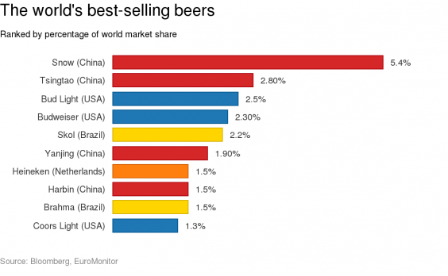

## There's no variety in beer
According to a [statista report](https://www.statista.com/statistics/188723/top-domestic-beer-brands-in-the-united-states/), the vast majority of beer sold in the US is a light pale lager.

The situation is not better when looking at the rest of the world.



---

## BrewTree helps you explore the world of beer

Using [kaggle](https://www.kaggle.com/) data on over [75,000 homemade beers](https://www.kaggle.com/jtrofe/beer-recipes/), I trained a random forest classifier to predict 32 different beer styles based on **alcohol content**, **bitterness** and **color**. 

```{r}
load("../app/model.rda")
fit$results
```

While an accuracy of 31% does not seem much at first, keep in mind the model is predicting 32 different styles of beer, many of which are very similar. For example, the only difference between an English and an American IPA is where the hops were grown!

--- .dark

## Thanks!

You can find the BrewTree app at [https://suur.shinyapps.io/brewtree/](https://suur.shinyapps.io/brewtree/).

Let's explore the world of beer, and not get lost in a random forest :)

<style>
@import "assets/css/custom.css";
</style>